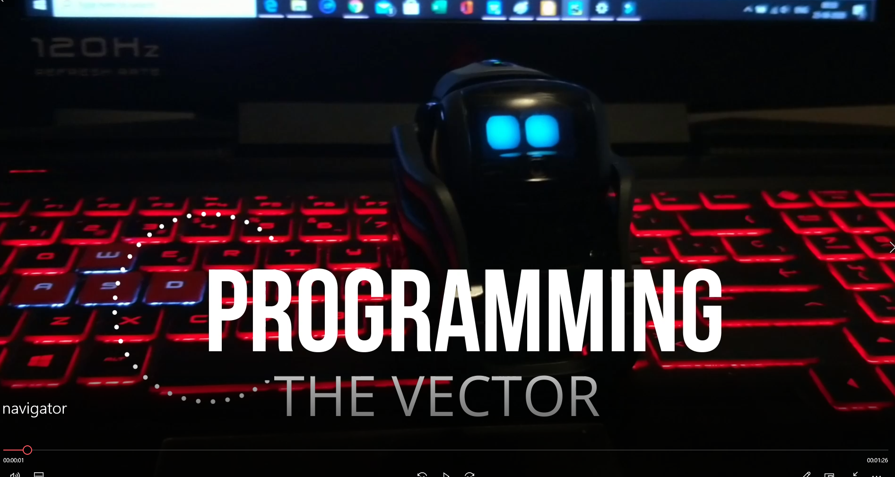

## RoboVector


In this project, a home robot known as Vector is programmed to do a few tasks based on voiced commands. It uses deep learning, computer vision and speech recognition, and is programmed using the Anki Vector SDK. The Vector SDK gives access to various capabilities of this robot, such as computer vision, Artificial intelligence, navigation, etc. You can design your own programs to make this robot pet imbibed with AI capabilities. Here, in this project, I have trained and used a real-time object detector which lets the robot to recognise objects in its surrounding environment. Moreover, in this module, instruction is provided on how to create your own customize object detector. However, in case if you don't have a Vector, then using this repository you can create your own custom object detector which can be tested using a webcam.


###  What Vector can do?
Vector is a home companion robot powered by AI and can do certain basic functions based on voice commands. It can take your photos, show you the weather, set timer, and many more. Also, since Vector comes with an SDK, one can program it to do more kinds of stuff than it normally does. So, in this project, I gave vector the capability of real-time object detection along with some more other functionalities.

Following is the class blue print representing the functionalities of the vector.

```python
class VecRobot:

    def __init__(self):
        self.name = 'vector'
        self.data_folder = os.path.join(get_parent_dir(n=1), "Data")
        self.model_folder = os.path.join(self.data_folder, "Model_Weights")
        self.model_weights = os.path.join(self.model_folder, "yolo.h5")
        self.model_classes = os.path.join(self.model_folder, "data_coco.txt")
        self.anchors_path = os.path.join(src_path, "keras_yolo3", "model_data", "yolo_anchors.txt")

    def get_classnames(self, classes):  # To get the names of the object detected

    def vector_speaks(self, text):  # Vector responds
      
    def speech_regognizer(self, recognizer, microphone):  # speech recognition for input voice commands
    
    def obstacle_detection(self): # Detects obstacle using its IR data
        
    def real_time_detection(self, param=None):  # detects objects in real time
       
    def display_image(self, file_name): # Display images in the screen of Vector
      
    def robot_moves(self): # robot moves
      
    def remote_control(self): # The robot can be controlled using W, A, S and D keys
      
      
```
### Real time object detection by Vector
Vector uses the YOLO network to recognize objects in real time. Also, details are mentioned in this project how to create a customized object detector. Please click the video to below see vector in action.


[](https://photos.google.com/share/AF1QipNDbPjIsUP1174OF26lhOxsUd7yUxr0tVIPPFKvhLnCHaNtNf7vvPwlLxvxP2lLrQ/photo/AF1QipMWvWpF5sVfuHzksRIa7AHFrBY8c0Tb9LpYQOnF?key=em9tUXpEMHk1amZEV2hXMnhGNUdSay0yRldjZnh3)

### Real time object detection by the trained model


